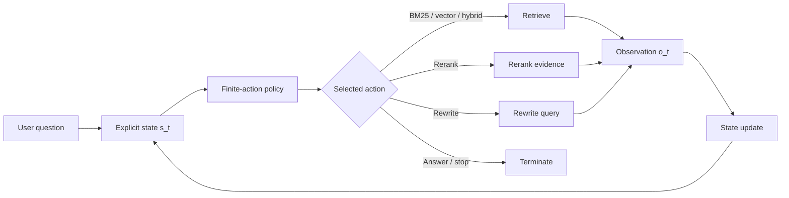

# Stateful Agentic Search

Stateful Agentic Search is a research architecture for retrieval agents whose control decisions are explicit, finite, measurable, and trainable.

Instead of asking a language model to generate an unrestricted reasoning trace before every tool call, the system gives a small policy model the current search state and asks it to choose one action from a fixed set. The selected tool runs, its observation updates the state, and the policy acts again.

The central hypothesis is:

> Agentic search can become faster, cheaper, and easier to optimize when tool selection is treated as a small sequential decision problem rather than a text-generation problem.

Experiment 0 implements the untrained constrained-decoding baseline. It does not perform SFT or reinforcement learning yet.

## Architecture

At time step $t$, the controller receives an explicit state:

$$
s_t = (q,\; \tilde q_t,\; D_t,\; h_t,\; b_t)
$$

where:

- $q$ is the original user question;
- $\tilde q_t$ is the current search query;
- $D_t$ is the current ranked evidence set and its scores;
- $h_t$ is the action and observation history;
- $b_t$ is the remaining step, latency, token, or monetary budget.

The action space is deliberately small:

$$
\mathcal A =
\{
\text{VECTOR},
\text{BM25},
\text{HYBRID},
\text{RERANK},
\text{REWRITE},
\text{ANSWER},
\text{STOP}
\}
$$

The policy produces one categorical distribution over those valid actions:

```math
\pi_\theta(a_t \mid s_t)
=
\frac{
\exp z_\theta(s_t,a_t)
}{
\sum_{a' \in \mathcal A}
\exp z_\theta(s_t,a')
}
```


Experiment 0 maps the actions to seven single-token codes and reads their logits after one model forward pass. At each state, actions that cannot be executed meaningfully are masked before normalization: answering and reranking require retrieved documents, and stopping is only offered after a search has been attempted, no results were found, and the final step is reached. The ReAct controller receives the same allowed-action list. If its output cannot be parsed as an allowed action, the run records an invalid policy output instead of silently treating it as STOP. Greedy selection uses

```math
a_t =
\arg\max_{a \in \mathcal A}
\pi_\theta(a \mid s_t)
```

while exploratory execution can sample $a_t \sim \pi_\theta(\cdot \mid s_t)$. Because the sampler only sees $\mathcal A$, syntactically invalid tool names have zero probability.

The environment executes the selected action and returns an observation:

```math
o_t = T_{a_t}(s_t),
\qquad
s_{t+1} = f(s_t,a_t,o_t)
```

This continues until the policy selects `ANSWER`, selects `STOP`, or exhausts its budget.



The policy, action sampler, tools, state transition, and answer generation are separate components. A production system can replace the retrievers or the model without changing the transition contract.
## Why this can speed up agentic search

A ReAct controller normally generates a variable-length sequence of reasoning tokens before emitting a tool name. If it generates $m_t$ tokens at step $t$, its controller cost is approximately:

```math
C_{\mathrm{ReAct},t}
\approx
C_{\mathrm{prefill}}(s_t)
+
\sum_{j=1}^{m_t}
C_{\mathrm{decode}}(s_t, y_{1:j-1})
```

The finite controller performs the state prefill and reads a small set of action logits directly:

```math
C_{\text{finite},t}
\approx
C_{\text{prefill}}(s_t)
+
C_{\text{select}}(|\mathcal A|)
```

For a small action set, C_{\text{select}} is negligible compared with autoregressive decoding. The architecture can also reduce total search cost by learning when another retrieval call is useful, which retriever fits the current evidence gap, and when the evidence is sufficient to answer.

The speed gain is therefore composed of two effects:

$$
\text{total latency}
=
\sum_{t=0}^{T-1}
\left(
\text{policy latency}_t
+
\text{tool latency}_t
\right)
$$

where finite decoding can reduce policy latency per step, and a trained policy can reduce the number of steps $T$.

## Initial speed result

The included pilot compares the finite controller with a free-form ReAct controller using the same Qwen2.5-0.5B-Instruct model, retrieval tools, questions, top-k, and four-step budget on an Apple M1 GPU.

| Metric | Finite policy | ReAct policy |
|---|---:|---:|
| Median end-to-end latency | 1.27 s | 2.21 s |
| Mean model time | 1.27 s | 2.22 s |
| Generated action/reasoning tokens per run | 4.0 | 26.7 |
| Valid-action rate | 100% | 100% |
| Retrieval success | 100% | 100% |
| nDCG@3 | 1.0 | 1.0 |

This is a **1.74× median speedup** in the small pilot. It is an architectural smoke test, not a general performance claim: the benchmark has three questions, both controllers used four steps on average, and the deterministic answer operation isolates controller and retrieval behavior. Larger corpora, more questions, stronger relevance labels, repeated hardware runs, and end-answer evaluation are needed for a serious comparison.

## Learning the policy

The interaction produces a trajectory

$$
\tau =
(s_0,a_0,o_0,s_1,a_1,o_1,\ldots,s_T)
$$

which makes search a finite-horizon Markov decision process when the state contains all decision-relevant history. If the state hides relevant information, the same system is better viewed as a partially observable MDP with the serialized state acting as a belief summary.

The training objective is expected discounted return:

$$
J(\theta)
=
\mathbb E_{\tau \sim \pi_\theta}
\left[
\sum_{t=0}^{T-1}
\gamma^t r_t
+
r_T
\right]
$$

### Reward design

A cost-aware terminal reward can combine answer quality, evidence quality, and execution cost:

$$
r_T
=
w_A Q_{\text{answer}}
+
w_R Q_{\text{retrieval}}
-
\lambda_c N_{\text{calls}}
-
\lambda_l L_{\text{ms}}
-
\lambda_k N_{\text{tokens}}
-
\lambda_i N_{\text{invalid}}
-
\lambda_d N_{\text{duplicate actions}}
$$

Possible quality terms include exact match, F1, an LLM or human preference score, Recall@k, nDCG@k, and citation support. Costs should be normalized to comparable scales before choosing the weights. A policy should not receive answer-quality credit without evidence attribution, or it may learn to answer early from parametric memory.

Dense progress rewards can shorten the credit-assignment path:

$$
r_t^{\text{progress}}
=
\eta
\left(
Q_{\text{evidence}}(s_{t+1})
-
Q_{\text{evidence}}(s_t)
\right)
$$

This is potential-based shaping when written as

$$
F(s_t,s_{t+1})
=
\gamma \Phi(s_{t+1})
-
\Phi(s_t)
$$

which preserves the optimal policy under the standard assumptions while supplying a denser learning signal.

### Stage 1: supervised policy learning

Before RL, successful or expert-generated trajectories give state-action examples $(s_t,a_t^*)$. Supervised fine-tuning minimizes categorical cross-entropy:

$$
\mathcal L_{\text{SFT}}(\theta)
=
-
\mathbb E_{(s,a^*) \sim \mathcal D}
\left[
\log \pi_\theta(a^* \mid s)
\right]
$$

This teaches action semantics and prevents early RL runs from spending most of their budget on malformed or obviously poor trajectories. Because the action space is finite, we can also report action accuracy, negative log-likelihood, Brier score, expected calibration error, and per-action confusion matrices.

### Stage 2: contextual-bandit optimization

Some decisions can first be trained as contextual bandits. Given a fixed state and observed utility $R(s,a)$, optimize

$$
J_{\text{bandit}}(\theta)
=
\mathbb E_{
s \sim \mathcal D,\,
a \sim \pi_\theta(\cdot \mid s)
}
\left[
R(s,a)
\right]
$$

This is useful for isolated choices such as selecting BM25 versus vector search from the initial query. It does not model how an early action changes later evidence, so full trajectories are required for rewrite, rerank, stopping, and budget-allocation behavior.

### Stage 3: sequential actor-critic training

For trajectory-level optimization, learn a value function $V_\phi(s_t)$ and estimate temporal-difference residuals:

$$
\delta_t
=
r_t
+
\gamma V_\phi(s_{t+1})
-
V_\phi(s_t)
$$

Generalized advantage estimation gives

$$
\hat A_t
=
\sum_{l=0}^{T-t-1}
(\gamma \lambda)^l
\delta_{t+l}
$$

A PPO-style update can then use the exact categorical action probabilities:

$$
\rho_t(\theta)
=
\frac{
\pi_\theta(a_t \mid s_t)
}{
\pi_{\theta_{\text{old}}}(a_t \mid s_t)
}
$$

and the clipped policy objective

$$
\mathcal L_{\text{clip}}(\theta)
=
-
\mathbb E_t
\left[
\min
\left(
\rho_t \hat A_t,\,
\operatorname{clip}
\left(
\rho_t,
1-\epsilon,
1+\epsilon
\right)
\hat A_t
\right)
\right]
$$

The full loss may include value regression and entropy regularization:

$$
\mathcal L
=
\mathcal L_{\text{clip}}
+
c_v
\mathbb E_t
\left[
\left(
V_\phi(s_t)-\hat G_t
\right)^2
\right]
-
c_H
\mathbb E_t
\left[
H\left(
\pi_\theta(\cdot \mid s_t)
\right)
\right]
$$

The finite action space is helpful here: action probabilities, entropy, KL divergence, and importance ratios are available exactly rather than being approximated over unconstrained text completions.

### Cost constraints instead of fixed reward weights

For deployment, latency or spend may be a constraint rather than a soft preference:

$$
\max_\theta
\;
\mathbb E
\left[
Q_{\text{answer}}(\tau)
\right]
\qquad
\text{subject to}
\qquad
\mathbb E[C(\tau)] \le B
$$

The Lagrangian objective is

$$
\max_\theta
\min_{\mu \ge 0}
\left\{
\mathbb E
\left[
Q_{\text{answer}}(\tau)
\right]
-
\mu
\left(
\mathbb E[C(\tau)]-B
\right)
\right\}
$$

Updating $\mu$ from observed budget violations lets the same architecture target different latency or cost budgets without hiding the tradeoff inside one manually tuned reward.

## Experimental roadmap

1. **Experiment 0 — constrained baseline:** compare a heuristic policy, vanilla Qwen finite-action decoding, and free-form ReAct.
2. **Experiment 1 — SFT:** train on expert, oracle, and successful-search state-action pairs.
3. **Experiment 2 — offline evaluation:** measure action accuracy, calibration, retrieval quality, answer quality, calls, tokens, and latency on held-out trajectories.
4. **Experiment 3 — online RL:** optimize the sequential cost-aware reward with PPO or another categorical actor-critic method.
5. **Experiment 4 — constrained RL:** learn policies for explicit latency and monetary budgets.
6. **Experiment 5 — generalization:** test new corpora, query types, retrievers, budgets, and action sets.

Every experiment should compare answer quality at matched cost and cost at matched answer quality. A faster policy that terminates without sufficient evidence is not an improvement.

The optimization path follows the ideas behind [policy-gradient methods](https://papers.nips.cc/paper/1999/hash/464d828b85b0bed98e80ade0a5c43b0f-Abstract.html), [generalized advantage estimation](https://arxiv.org/abs/1506.02438), [PPO](https://arxiv.org/abs/1707.06347), and [potential-based reward shaping](https://people.eecs.berkeley.edu/~pabbeel/cs287-fa09/readings/NgHaradaRussell-shaping-ICML1999.pdf). The free-form comparison is based on the reasoning-and-action pattern introduced by [ReAct](https://arxiv.org/abs/2210.03629).

## Building tool arguments from state

Choosing a tool and calling it are separate decisions. The finite policy answers “which operation next?”; it does not have to generate free-form parameters. A typed task interpreter can make one initial SLM call to turn the user's request into a validated context:

```text
TaskContext
  goal: what must be found
  query: initial retrieval query
  scope: searchable source
  include_globs / exclude_globs: file or source filters
  constraints: explicit restrictions
```

At each later step, `build_tool_call(state, action)` creates arguments from that context and the live state, then validates them against that action's Pydantic schema. For example, BM25 gets the current query and configured top-k; reranking gets the query plus IDs of retrieved documents; answering gets the goal plus evidence IDs; query rewriting gets the goal and current query. The serialized trajectory records both the validated arguments and where each value came from.

This keeps the fast finite policy focused on action selection while giving tools the inputs they actually need. The initial `--state-interpreter qwen` mode is intentionally a separate, measurable call—not hidden inside the policy. Its output must satisfy the TaskContext schema or the run fails visibly. The default `passthrough` interpreter makes no model call and preserves the user's question as both goal and query. A future harness can replace either component independently, and SFT/RL can train the finite policy on explicit states without changing tool argument contracts.

## Current implementation

Experiment 0 includes:

- an explicit serializable agent state;
- a seven-action schema;
- deterministic local BM25-like, hashing-vector, hybrid, reranking, and query-rewrite tools;
- a reproducible heuristic policy;
- a Qwen finite-action policy using one-token action codes;
- a Qwen ReAct comparison policy;
- trajectory logging with probabilities, observations, tokens, calls, and latency;
- retrieval, policy, and efficiency metrics;
- a small in-repository corpus and benchmark.

The local retrieval implementations are test fixtures, not production search engines. Their interfaces are intended to be replaced by real BM25, embedding, hybrid-search, and reranking services.

## Repository layout

```text
src/agentic_policy/
  actions.py          finite action schema
  state.py            state, decisions, and trajectory records
  schemas.py          validated task context and per-action tool arguments
  arguments.py        state-to-tool-argument construction
  state_interpreter.py passthrough and Qwen task-context interpreters
  policy.py           heuristic, finite Qwen, and ReAct policies
  loop.py             policy → action → observation transition loop
  retrieval.py        local retrieval and reranking tools
  model_adapters.py   shared causal-language-model runtime
  evaluation.py       retrieval, policy, and efficiency metrics
  experiments/        demo, benchmark, and speed-comparison commands
data/
  demo_corpus.jsonl
  demo_benchmark.jsonl
tests/
```

## Quick start

Python 3.10 or newer is required.

```bash
python -m venv .venv
source .venv/bin/activate
pip install -e '.[dev]'
pytest
```

Run the dependency-free reproducible baseline:

```bash
agentic-policy-demo --policy heuristic --seed 7
agentic-policy-benchmark \
  --policy heuristic \
  --output runs/benchmark.jsonl
```

Install the model dependencies and run constrained Qwen action selection:

```bash
pip install -e '.[qwen]'
agentic-policy-demo \
  --policy qwen \
  --model Qwen/Qwen2.5-1.5B-Instruct \
  --device auto \
  --sampling greedy
```

Compare finite-action selection with free-form ReAct using one shared model instance:

```bash
agentic-policy-speed \
  --model Qwen/Qwen2.5-1.5B-Instruct \
  --device auto \
  --warmups 1 \
  --repetitions 5 \
  --output runs/speed_comparison.json
```

Each benchmark output retains the complete per-step trajectory so results can be audited rather than reduced to one aggregate number.
